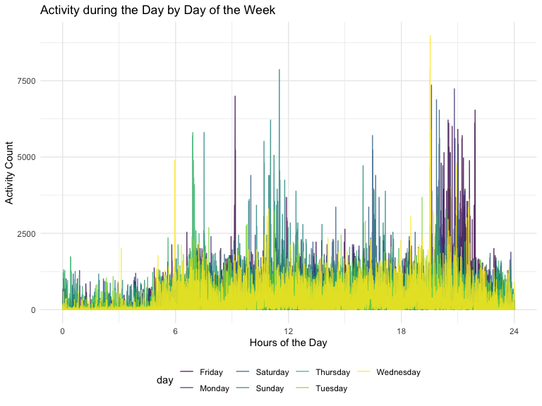

p8105_hw3_ltc2121
================
Lindsey Covell

    ## ── Attaching packages ─────────────────────────────────────── tidyverse 1.3.2 ──
    ## ✔ ggplot2 3.3.6      ✔ purrr   0.3.4 
    ## ✔ tibble  3.1.8      ✔ dplyr   1.0.10
    ## ✔ tidyr   1.2.1      ✔ stringr 1.4.1 
    ## ✔ readr   2.1.2      ✔ forcats 0.5.2 
    ## ── Conflicts ────────────────────────────────────────── tidyverse_conflicts() ──
    ## ✖ dplyr::filter() masks stats::filter()
    ## ✖ dplyr::lag()    masks stats::lag()

## Problem 1

``` r
data("instacart")

instacart = 
  instacart %>% 
  as_tibble(instacart)
```

This dataset contains 1384617 rows and 15 columns. Each row represents a
single product from an instacart order.In total, there are 39123
products found in 131209 orders from 131209 distinct users.

There are a total of 134 aisles, with fresh vegetables and fresh fruits
having the most items ordered from compared to all other aisles.

``` r
instacart %>% 
  count(aisle) %>% 
    arrange(desc(n))
```

    ## # A tibble: 134 × 2
    ##    aisle                              n
    ##    <chr>                          <int>
    ##  1 fresh vegetables              150609
    ##  2 fresh fruits                  150473
    ##  3 packaged vegetables fruits     78493
    ##  4 yogurt                         55240
    ##  5 packaged cheese                41699
    ##  6 water seltzer sparkling water  36617
    ##  7 milk                           32644
    ##  8 chips pretzels                 31269
    ##  9 soy lactosefree                26240
    ## 10 bread                          23635
    ## # … with 124 more rows

Here is a plot which shows the number of items ordered in each aisle,
starting with aisles that have at least 1000 items ordered from them.

``` r
instacart %>% 
  count(aisle) %>% 
  filter(n > 10000) %>% 
  mutate(aisle = fct_reorder(aisle, n)) %>% 
  ggplot(aes(x = aisle, y = n)) +
  geom_point() + 
    labs(title = "Number of items ordered in each aisle") +
  theme(axis.text.x = element_text(angle = 60, hjust = 1))
```


This table shows the three most popular items in aisles
`baking ingredients`, `dog food care`, and `packaged vegetables fruits`
, and includes the number of times each item is ordered in your table.

``` r
instacart %>% 
  filter(aisle %in% c("baking ingredients", "dog food care", "packaged vegetables fruits")) %>%
  group_by(aisle) %>% 
  count(product_name) %>% 
  mutate(rank = min_rank(desc(n)))  %>% 
  filter(rank < 4) %>% 
  arrange(desc(n)) %>%
  knitr::kable()
```

| aisle                      | product_name                                  |    n | rank |
|:---------------------------|:----------------------------------------------|-----:|-----:|
| packaged vegetables fruits | Organic Baby Spinach                          | 9784 |    1 |
| packaged vegetables fruits | Organic Raspberries                           | 5546 |    2 |
| packaged vegetables fruits | Organic Blueberries                           | 4966 |    3 |
| baking ingredients         | Light Brown Sugar                             |  499 |    1 |
| baking ingredients         | Pure Baking Soda                              |  387 |    2 |
| baking ingredients         | Cane Sugar                                    |  336 |    3 |
| dog food care              | Snack Sticks Chicken & Rice Recipe Dog Treats |   30 |    1 |
| dog food care              | Organix Chicken & Brown Rice Recipe           |   28 |    2 |
| dog food care              | Small Dog Biscuits                            |   26 |    3 |

This table shows the mean hour of the day at which Pink Lady Apples and
Coffee Ice Cream are ordered on each day of the week in a format that is
easy for viewing.

``` r
instacart %>% 
  filter(product_name %in% c("Pink Lady Apples", "Coffee Ice Cream")) %>%
  group_by(product_name, order_dow) %>%
  summarize(mean_hour = mean(order_hour_of_day, na.rm = TRUE)) %>%
  pivot_wider(
    names_from = order_dow, 
    values_from = mean_hour) %>% 
  knitr::kable(digits = 2)
```

    ## `summarise()` has grouped output by 'product_name'. You can override using the
    ## `.groups` argument.

| product_name     |     0 |     1 |     2 |     3 |     4 |     5 |     6 |
|:-----------------|------:|------:|------:|------:|------:|------:|------:|
| Coffee Ice Cream | 13.77 | 14.32 | 15.38 | 15.32 | 15.22 | 12.26 | 13.83 |
| Pink Lady Apples | 13.44 | 11.36 | 11.70 | 14.25 | 11.55 | 12.78 | 11.94 |

## Problem 2

``` r
activity_df = 
  read_csv("hw3_data/accel_data.csv") %>% 
  pivot_longer(
    activity.1:activity.1440,
    names_to = "minute", 
    names_prefix = "activity.",
    values_to = "activity_count"
  ) %>% 
  mutate(
    activity_count = round(activity_count, 2), 
    day_type = ifelse(day == "Friday", "weekend", 
                     ifelse(day == "Saturday", "weekend", 
                            ifelse(day == "Sunday", "weekend", "weekday"))), 
  minute = as.numeric(minute), 
  day_type = as.factor(day_type))
```

    ## Rows: 35 Columns: 1443
    ## ── Column specification ────────────────────────────────────────────────────────
    ## Delimiter: ","
    ## chr    (1): day
    ## dbl (1442): week, day_id, activity.1, activity.2, activity.3, activity.4, ac...
    ## 
    ## ℹ Use `spec()` to retrieve the full column specification for this data.
    ## ℹ Specify the column types or set `show_col_types = FALSE` to quiet this message.

This dataset contains 50400 rows and 6 columns. Each row shows a
distinct `activity count` for a given `minute` throughout a given `day`
starting at midnight. The dataset spans over 5 weeks and includes 35
days of activity monitoring. The dataset also contains a variable that
describes if the day constitutes as a weekend or a weekday.

``` r
activity_df %>% 
  group_by(week, day) %>% 
  summarise(total_activity = 
              sum(activity_count)) %>% 
  mutate(total_activity = round(total_activity, 0)) %>% 
  pivot_wider(names_from = day, values_from = total_activity ) %>% 
  knitr::kable()
```

    ## `summarise()` has grouped output by 'week'. You can override using the
    ## `.groups` argument.

| week | Friday | Monday | Saturday | Sunday | Thursday | Tuesday | Wednesday |
|-----:|-------:|-------:|---------:|-------:|---------:|--------:|----------:|
|    1 | 480543 |  78828 |   376254 | 631105 |   355924 |  307094 |    340115 |
|    2 | 568839 | 295431 |   607175 | 422018 |   474048 |  423245 |    440962 |
|    3 | 467420 | 685910 |   382928 | 467052 |   371230 |  381507 |    468869 |
|    4 | 154049 | 409450 |     1440 | 260617 |   340291 |  319568 |    434460 |
|    5 | 620860 | 389080 |     1440 | 138421 |   549658 |  367824 |    445366 |

``` r
######## arrange(desc(total_activity)) %>% ######## if using long data #### if not REMOVE !!
# 
```

The table above shows the total activity count for each day of the week.
From this table you are able to see some general trends in activity. It
seems like Saturday’s are notably days with lower activity count, while
Friday’s seem to have higher activity counts.

``` r
activity_df %>% 
  ggplot(aes( x = minute, y = activity_count, color = day)) + 
  geom_point( alpha = .5) + 
  labs(
    title = "Activity during the Day by Day of the Week",
    x = "Hours of the Day",
    y = "Activity Count") + 
  scale_x_continuous(
    breaks = c(0, 360, 720, 1080, 1440), 
    labels = c("0", "6", "12", "18", "24"))
```



The graph above shows the activity count over the 24 hour day for each
day in the dataset. The graph is grouped by day of the week. The graph
shows that this individual typically starts their day around 7th-8th
hour of the day. It is seen through outlying point that this person is
more typical to have deviate from their average activity level on the
weekend days. They typically have an increase in activity level between
the 20th-22nd hour of the day, especially on Friday’s.

## Problem 3

``` r
data("ny_noaa")
```

This dataset contains 2595176 rows and 7 columns. Each observation in
the dataset is an individual daily reading from one of the New York
state weather stations. There are 747 different weather stations in the
dataset. The weather station readings were taken from 1981-01-01 to
2010-12-31. The variables key measured from the weather station are
precipitation, snowfall, snow depth, maximum temperature, and minimum
temperature. There is a notable amount of missing data since not all of
the weather stations measure each variable. In total, there are 3387623
missing values out of 12975880 values combined from all of the measured
variables in the dataset.

``` r
ny_noaa = ny_noaa %>% 
  mutate(year = lubridate::year(date), 
                month = lubridate::month(date), 
                day = lubridate::day(date), 
         tmax = as.numeric(tmax),
         tmin = as.numeric(tmin), 
         tmax = tmax / 10, 
         tmin = tmin / 10, 
         prcp = prcp / 10)

Hmisc::describe(ny_noaa$snow)
```

    ## ny_noaa$snow 
    ##        n  missing distinct     Info     Mean      Gmd      .05      .10 
    ##  2213955   381221      281    0.253    4.987    9.542        0        0 
    ##      .25      .50      .75      .90      .95 
    ##        0        0        0        0       25 
    ## 
    ## lowest :   -13     0     3     5     8, highest:  1207  6350  7122  7765 10160
    ## 
    ## 0 (2133870, 0.964), 100 (64546, 0.029), 200 (11258, 0.005), 300 (2831, 0.001),
    ## 400 (866, 0.000), 500 (333, 0.000), 600 (146, 0.000), 700 (51, 0.000), 800 (32,
    ## 0.000), 900 (10, 0.000), 1000 (4, 0.000), 1100 (3, 0.000), 1200 (1, 0.000),
    ## 6300 (1, 0.000), 7100 (1, 0.000), 7800 (1, 0.000), 10200 (1, 0.000)
    ## 
    ## For the frequency table, variable is rounded to the nearest 100

The frequency information above shows that the most commonly observed
value for snowfall is 0mm of snow. This is because throughout all of New
York, they’re are significantly more days in the year of no snow fall
compared to days when it is snowing.

``` r
month_names <- c(`1` = "January", `7` = "July")
  
ny_noaa %>% 
  filter(month == c(1, 7)) %>% 
  group_by(year, month, id) %>% 
  summarise(mean_tmax = mean(tmax, na.rm = TRUE)) %>% 
  ggplot(aes(x = year, y = mean_tmax, color = id)) +
    geom_line(size = 0.1)  +
  facet_grid(.~month, labeller = as_labeller(month_names)) +
  theme(axis.text.x = element_text(angle = 60, hjust = 1), 
        legend.position = "none") +
   labs(
    title = "Average Max Temperature at Each Weather Station",
    x = "Year",
    y = "Average Max Temperature (C)")
```

    ## `summarise()` has grouped output by 'year', 'month'. You can override using the
    ## `.groups` argument.


The graph above shows the average maximum temperature at each weather
station across the monitoring years of 1980 to 2010 for the months of
January and July. This figure shows the fluctuating average maximum
temperatures across the years. There is more variability in average
maximum temperature for the month of January compared to the month of
July. There is a notable outlier in July that shows a drop in the
average roughly around 1988. There is a peak outlier in January that
shows a spike in the average around 2004.
